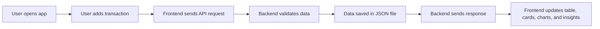

# Student Expense Tracker

This is a beginner-friendly full-stack capstone project for tracking student income and expenses.

The project has:

- Frontend made with HTML, CSS, JavaScript, and Chart.js
- Backend made with Node.js and Express.js
- Simple JSON file storage instead of MongoDB
- REST API integration between frontend and backend
- CRUD operations, validation, search, filter, summary cards, charts, and smart insights

## Project Goal

Students can add their income and expenses, view all transactions, edit or delete old records, search and filter records, and understand spending through charts and summary values.

## Folder Structure

```text
expense-tracker/
|-- frontend/
|   |-- index.html
|   |-- styles.css
|   `-- app.js
|
|-- backend/
|   |-- package.json
|   |-- data/
|   |   `-- transactions.json
|   `-- src/
|       |-- server.js
|       |-- seed.js
|       `-- routes/
|           `-- transactions.js
|
`-- README.md
```

## Frontend Documentation

### `frontend/index.html`

This file contains the page structure.

Main sections:

- Header with app name
- Summary cards for income, expenses, and balance
- Transaction form to add or edit records
- Smart insights section
- Bar chart and pie chart
- Search and filter controls
- Transaction table

Important element IDs used by JavaScript:

- `expenseForm` - transaction form
- `transactionList` - table body where transactions are shown
- `income`, `expenses`, `balance` - summary cards
- `barChart`, `pieChart` - Chart.js chart areas
- `search`, `filterType`, `filterCategory` - filter inputs

### `frontend/styles.css`

This file contains simple responsive styling.

It styles:

- Page background and font
- Header
- Cards
- Form
- Buttons
- Table
- Mobile responsive layout

The layout uses CSS grid. On small screens, the grid becomes one column.

### `frontend/app.js`

This file contains all frontend logic.

Main variables:

- `API` - backend API URL
- `categories` - list of transaction categories
- `transactions` - stores transactions loaded from backend
- `barChart`, `pieChart` - store Chart.js chart objects

Main functions:

- `fillCategories()` - adds category options to dropdowns
- `api()` - sends requests to backend
- `getFormData()` - reads form input values
- `clearForm()` - resets the form
- `loadTransactions()` - loads transactions and summary from backend
- `showTransactions()` - displays transactions in table
- `showSummary()` - updates income, expenses, balance, and insights
- `showCharts()` - creates bar chart and pie chart
- `editTransaction()` - fills the form with selected transaction data
- `deleteTransaction()` - deletes a selected transaction

Frontend API calls:

- `GET /api/transactions`
- `GET /api/transactions/summary`
- `POST /api/transactions`
- `PUT /api/transactions/:id`
- `DELETE /api/transactions/:id`

## Backend Documentation

### `backend/src/server.js`

This file starts the Express server.

It does three main things:

1. Imports Express and CORS
2. Adds middleware for JSON data and CORS
3. Connects transaction routes to `/api/transactions`

Server runs at:

```text
http://localhost:5001
```

Health check route:

```text
GET /api/health
```

### `backend/src/routes/transactions.js`

This file contains the main backend API logic.

It uses:

- `fs` to read and write the JSON file
- `path` to locate the data file
- Express router for API routes

Important functions:

- `readData()` - reads transactions from `transactions.json`
- `writeData()` - saves transactions to `transactions.json`
- `checkData()` - validates title, amount, type, category, and date
- `filterData()` - filters transactions by search, type, and category
- `makeSummary()` - calculates income, expenses, balance, chart data, and insights

### `backend/data/transactions.json`

This file acts as the database.

Each transaction has:

```json
{
  "_id": "1",
  "title": "Hostel rent",
  "type": "expense",
  "amount": 6000,
  "category": "Rent",
  "date": "2026-04-05",
  "note": "April rent"
}
```

### `backend/src/seed.js`

This file resets demo data.

Run it when you want fresh sample data:

```bash
npm run seed
```

## API Documentation

Base URL:

```text
http://localhost:5001/api
```

| Method | Endpoint | Description |
| --- | --- | --- |
| GET | `/health` | Checks if API is running |
| GET | `/transactions/categories` | Gets all categories |
| GET | `/transactions` | Gets all transactions |
| GET | `/transactions/summary` | Gets totals, chart data, and insights |
| POST | `/transactions` | Adds a new transaction |
| PUT | `/transactions/:id` | Updates a transaction |
| DELETE | `/transactions/:id` | Deletes a transaction |

### Search and Filter

The transaction list and summary routes support query parameters:

```text
/api/transactions?search=rent&type=expense&category=Rent
```

Supported filters:

- `search`
- `type`
- `category`

### Add Transaction Example

```http
POST /api/transactions
Content-Type: application/json
```

```json
{
  "title": "Lunch",
  "amount": 120,
  "type": "expense",
  "category": "Food",
  "date": "2026-05-03",
  "note": "College canteen"
}
```

## Features

- Add income and expense
- View transaction history
- Edit transaction
- Delete transaction
- Search transactions
- Filter by type
- Filter by category
- Form validation
- Total income calculation
- Total expense calculation
- Balance calculation
- Highest spending category insight
- Monthly spending trend insight
- Monthly bar chart
- Category pie chart

## Data Validation

The backend checks:

- Title is required
- Amount must be greater than zero
- Type must be `income` or `expense`
- Category must be valid
- Date is required

If data is invalid, the API returns an error message.

## Product Flow



## How to Run

### 1. Start Backend

```bash
cd backend
npm install
npm start
```

Backend will run on:

```text
http://localhost:5001
```

### 2. Open Frontend

Open this file in browser:

```text
frontend/index.html
```

Or run a simple frontend server:

```bash
cd frontend
python3 -m http.server 5500
```

Then open:

```text
http://localhost:5500
```

## Deployment Notes

Frontend can be deployed on:

- Netlify
- Vercel
- GitHub Pages

Backend can be deployed on:

- Render
- Railway
- Cyclic

For a real production app, MongoDB can be added later. This version uses JSON storage to keep the code simple and beginner-friendly.

## Developers

Kritika Rawat and Nick Tyagi
